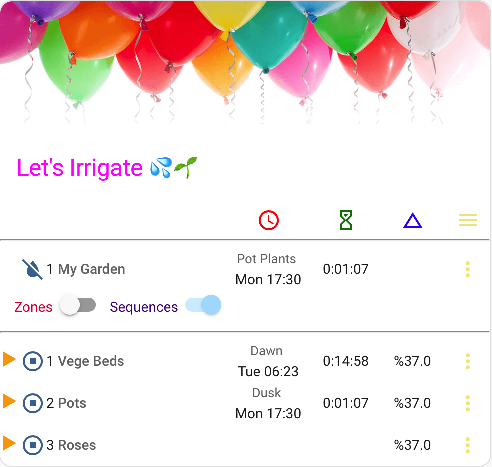
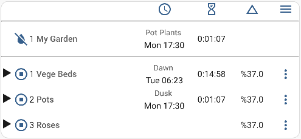

<!-- omit in toc -->

# Irrigation Unlimited Card

[![GitHub Release][releases-shield]][releases]
[![License][license-shield]](LICENSE.md)
[](https://github.com/custom-components/hacs)

![Project Maintenance][maintenance-shield]
[![GitHub Activity][commits-shield]][commits]

[![Community Forum][forum-shield]][forum]

<!-- TOC depthfrom:2 orderedlist:true -->

- [1. Introduction](#1-introduction)
- [2. Installation](#2-installation)
- [3. Options](#3-options)
- [4. Explore](#4-explore)
  - [4.1. Party mode](#41-party-mode)
  - [4.2. Minimalist](#42-minimalist)
  - [4.3. Hidden](#43-hidden)
  - [4.4. Class Structure](#44-class-structure)
- [5. Translations](#5-translations)
- [6. Support](#6-support)

## 1. Introduction

A companion card for the [Irrigation Unlimited](https://github.com/rgc99/irrigation_unlimited) integration. A compact mobile friendly card to display live irrigation status and control its operation.


## 2. Installation

Add through [HACS](https://github.com/hacs/integration).

Issues regarding the installation should be asked in the [Home Asssitant forum](https://community.home-assistant.io/t/irrigation-unlimited-integration).

In most circumstances you do not need to read beyond this point - just instal and enjoy.

## 3. Options

This section is for people wanting to use [YAML](https://yaml.org) to edit the configuration. Everything listed here is available in the graphical editor.

| Name                    | Type    | Requirement  | Description                                | Default                |
| ----------------------- | ------- | ------------ | ------------------------------------------ | ---------------------- |
| type                    | string  | **Required** | `custom:irrigation-unlimited-card`         |                        |
| name                    | string  | **Optional** | Card name                                  | `Irrigation Unlimited` |
| controllers             | string  | **Optional** | CSV list of controllers to display         |                        |
| always_show_zones       | boolean | **Optional** | Force the zones to always be displayed     | false                  |
| always_show_sequences   | boolean | **Optional** | Force the sequences to always be displayed | false                  |
| show_timeline_scheduled | boolean | **Optional** | Show scheduled items in the timeline       | true                   |
| show_timeline_history   | boolean | **Optional** | Show history items in the timeline         | true                   |

## 4. Explore

The card is ready to go as is and this section is for people wanting to explore a little further. It demonstrates some of the possibilites by applying CSS styling to various elements of the card. It assumes reasonable knowledge of [CSS styling](https://developer.mozilla.org/en-US/docs/Web/CSS) and the use of [YAML](https://yaml.org). The following examples require [card_mod](https://github.com/thomasloven/lovelace-card-mod). Just to repeat you **MUST** install [card_mod](https://github.com/thomasloven/lovelace-card-mod) or none of this works.

### 4.1 Party mode

Let's brighten up the card by adding some colour. This example adds a header (and possibly a footer). It is embedded within an [Entities card](https://www.home-assistant.io/dashboards/entities/) which opens up even more possibilities to add buttons and such. Sunglasses maybe required for this demo and some bubbly.



```yaml
type: entities
header:
  type: picture
  image: >-
    https://www.home-assistant.io/images/dashboards/header-footer/balloons-header.png
entities:
  - type: custom:irrigation-unlimited-card
    name: Let's Irrigate 💦🌱
    always_show_sequences: true
    always_show_zones: false
    card_mod:
      style:
        $: |
          /* Colour the card title */
          h1.card-header { color: magenta }
        .: |
          /* Remove border around card */
          ha-card { border: none }

          /* Colour header icons */
          div.iu-header-row .iu-td4 ha-icon { color: red }
          div.iu-header-row .iu-td5 ha-icon { color: green }
          div.iu-header-row .iu-td6 ha-icon { color: blue }
          div.iu-header-row .iu-td7 ha-icon { color: khaki }

          /* Colour the controls */
          div.iu-control-panel-item.iu-show-zones {color: crimson }
          div.iu-control-panel-item.iu-show-sequences {color: indigo }

          /* Colour the expanders */
          div.iu-expander.iu-td1 { color: orange }

          /* Colour the menu buttons */
          div.iu-menu > ha-icon { color: khaki }

          /* Colour the menu items */
          div.iu-menu-item.iu-enable { color: green }
          div.iu-menu-item.iu-suspend { color: blue }
          div.iu-menu-item.iu-manual { color: red }
          div.iu-menu-item.iu-cancel { color: purple }
          div.iu-menu-item.iu-adjust { color: orange }
state_color: false
card_mod:
  style: |
    div.card-content {
      padding: 0;
    }
```

### 4.2 Minimalist

This example removes the controller menu along with the zone and sequence controls. It only shows sequences.



```yaml
type: custom:irrigation-unlimited-card
always_show_sequences: true
always_show_zones: false
card_mod:
  style: |
    /* Remove controller menu */
    div.iu-controller-row .iu-td7 { visibility: hidden }

    /* Remove zone and sequence buttons */
    div.iu-control-panel { display: none }
```

### 4.3 Hidden

This example shows how to remove/hide various elements. Rather than just playing show and tell there are numerous other opportunities to manipulate elements.

```yaml
type: custom:irrigation-unlimited-card
always_show_sequences: true
always_show_zones: true
card_mod:
  style: |
    /* Hide the header row */
    div.iu-header-row { display: none }

    /* Hide the line seperating controllers */
    div.iu-controller > hr { display: none }

    /* Hide the line seperating zones */
    div.iu-zones > hr { display: none }

    /* Hide the line seperating sequences */
    div.iu-sequences > hr { display: none }

    /* Hide the zone and sequence buttons */
    div.iu-control-panel { display: none }

    /* Hide the controller menu */
    div.iu-controller-row .iu-td7 { visibility: hidden }

    /* Hide the zone menu */
    div.iu-zone-row .iu-td7 { visibility: hidden }

    /* Hide the sequence menu */
    div.iu-sequence-row .iu-td7 { visibility: hidden }

    /* Hide the sequence zone menu */
    div.iu-sequence-zone-row .iu-td7 { visibility: hidden }

    /* Hide the 2nd zone on controller 1 */
    div.iu-zone[iu-key="1.2.0.0"] { display: none }

    /* Hide the 4th sequence on controller 1 */
    div.iu-sequence[iu-key="1.0.4.0"] { display: none }
```

### 4.4 Class structure

Here follows an in depth explaination of the innner workings. The card is basically laid out as a 7 column wide table.

```text
└──ha-card
  └── iu-header                       | The header row
    └── iu-header-row                 | The rows with the icons
  └── iu-controllers                  | Container for all controllers
    └── iu-controller                 | Container for the controller \*Note 1
      └── iu-control-panel            | Container for the zone and sequence buttons
      └── iu-controller-row           | The controller line
      └── iu-zones                    | Container for all zones
        └── iu-zone                   | Container for each zone \*Note 1
          └── iu-zone-row             | The zone line
          └── iu-zone-timelines       | Container for the timelines
            └── iu-zone-timeline      | One for each timeline item
      └── iu-sequences                | Container for all sequences
        └── iu-sequence               | Container for each sequence \*Note 1
        └── iu-sequence-row           | The sequence line
        └── iu-sequence-zones         | Container for all sequence zones
          └── iu-sequence-zone        | Container for each sequence zone \*Note 1
            └── iu-sequence-zone-row  | The sequence zone line
```

\*Note 1: These objects may have one or more additional attributes as shown below

| Class        | Description                                |
| ------------ | ------------------------------------------ |
| iu-on        | The object is on                           |
| iu-paused    | The object is paused                       |
| iu-delay     | The object is in delay state               |
| iu-enabled   | The object is enabled                      |
| iu-suspended | The object is suspended                    |
| iu-manual    | The run is manual not scheduled            |
| iu-running   | The object is running                      |
| iu-blocked   | The object is blocked                      |
| iu-key       | Identifies the individual object. \*Note 2 |

\*Note 2: The nomenclature is controller.zone.sequence.sequence_zone for example "1.0.1.0" is sequence 1 of controller 1.

Column class identifiers. Additional classes maybe present as required. For example not every iu-td1 column has an expander.

| Class  | Additional classes   | Description |
| ------ | -------------------- | ----------- |
| iu-td1 | iu-expander          | Expander    |
| iu-td2 | ha-icon              | Icon        |
| iu-td3 | iu-name              | Name        |
| iu-td4 | iu-schedule iu-start | Schedule    |
| iu-td5 | iu-duration          | Duration    |
| iu-td6 | iu-adjustment        | Adjustment  |
| iu-td7 |                      | Menu        |

Menu identifiers. Menus are laid out on a 3 columm grid.

Menu rows

| Class        | Additional classes | Description                   |
| ------------ | ------------------ | ----------------------------- |
| iu-menu      |                    | Container for the entire menu |
| iu-menu-item | \*Note 3           | Container for the menu item   |

\*Note 3: One of the following classes to identify the item `iu-enable` `iu-suspend` `iu-manual` `iu-pause` `iu-resume` `iu-cancel` `iu-adjust`

Menu columns

| Class  | Additional classes | Description |
| ------ | ------------------ | ----------- |
| iu-mc1 |                    | Name        |
| iu-mc2 | input              | Input       |
| iu-mc3 | ha-icon            | Button      |

If you have got this far and done something interesting then please [share][forum].

Good luck with your card-modding.

## 5. Translations

If you would like the drop down menu and the options editor in your local language then please contribute a translate. See [here](https://github.com/rgc99/irrigation-unlimited-card/discussions/15) for further details.

## 6. Support

[![BuyMeCoffee][buymecoffeebadge]][buymecoffee]

[buymecoffee]: https://www.buymeacoffee.com/rgc99
[buymecoffeebadge]: https://img.shields.io/badge/buy%20me%20a%20coffee-donate-yellow.svg?style=for-the-badge
[commits-shield]: https://img.shields.io/github/commit-activity/y/rgc99/irrigation-unlimited-card?style=for-the-badge
[commits]: https://github.com/rgc99/irrigation-unlimited-card/commits/master
[forum-shield]: https://img.shields.io/badge/community-forum-brightgreen.svg?style=for-the-badge
[forum]: https://community.home-assistant.io/t/irrigation-unlimited-integration/
[license-shield]: https://img.shields.io/github/license/rgc99/irrigation-unlimited-card.svg?style=for-the-badge
[maintenance-shield]: https://img.shields.io/badge/maintainer-Robert%20Cook%20%40rgc99-blue.svg?style=for-the-badge
[releases-shield]: https://img.shields.io/github/release/rgc99/irrigation-unlimited-card.svg?style=for-the-badge
[releases]: https://github.com/rgc99/irrigation-unlimited-card/releases
